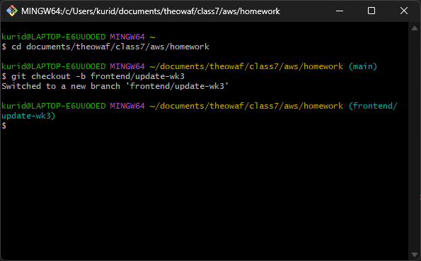

##  Walkthrough for a GitHub Merge Request

Here is a step-by-step walkthrough to do a successful git merge request using GitHub

### Step 1: Create Your Branch

On your local machine, from your project's main directory, create a new branch to hold your changes.

Bash commands:

```
# This creates a new branch called "frontend/update-wk3" and switches to it
git checkout -b frontend/update-wk3
```



### Step 2: Make Your Changes

Now, you can make your necessary changes for your directory. For your example, you would create a `2-week` directory and add any new files inside it.

### Step 3: Stage and Commit

Save your work to the branch's history.

Bash commands:

```
# Stage all new and modified files for commit
git add .

# Commit the staged files with a descriptive message
git commit -m "Frontend: Add content for week3"
```

.png)
### Step 4: Push to GitHub

Send your new branch and its commits to the remote repository on GitHub.

Bash commands:

```
# Push the branch and set up remote tracking
git push -u origin frontend/update-wk3
```

.png)
.png)

### Step 5: Create the Pull Request (PR)

Go to your repository on GitHub. You will immediately see a yellow notification bar with your new branch name, prompting you to create a pull request.

Click the **"Compare & pull request"** button. This will take you to a new page where you can give your pull request a title and description.

.png)

### Step 6: Merge the Pull Request

On the pull request page, you can see all the changes you made. This is where a teammate would review your code and approve any changes, if it looks good and there are no conflicts, you can merge it.

Click the green **"Merge pull request"** button, and then confirm the merge.

Success! Your `frontend/update-wk3` branch has now been merged into the `main` branch. All your new files are now part of the official project.

.png)

.png)


### Step 7: Clean Up

After a successful merge, it's good practice to delete the branch, as it's no longer needed. GitHub provides an easy button for this right after you merge.

Click the **"Delete branch"** button to remove the `frontend/update-wk3` branch from the remote GitHub repository.

.png)

---
## Post-Merge Branch Cleanup

This procedure outlines the necessary steps to synchronize your local repo and remove the branch(s) no longer in use, after a feature/temporary branch has been successfully merged into the `main` branch on the remote repository.

### Step 1: Return to the Main Branch

Switch your local working directory back to the `main` branch. This is the primary branch of the project and should serve as the starting point for all new work.

Bash commands:

```
git checkout main
```


### Step 2: Synchronize the Local Main Branch

Update your local `main` branch to include the newly merged changes from the remote repository (`origin`). This ensures your local version is up-to-date with the official project history.

Bash commands:

```
git pull origin main
```

.png)

### Step 3: Delete the Local Feature Branch

Remove the feature branch from your local repository. As its changes are now part of `main`, this branch is no longer needed and can be deleted to maintain a clean workspace.

Bash commands

```
git branch -d frontend/update-wk3
```

.png)

**Note:** Use the `-d` (delete) flag for this operation. Git will prevent deletion if the branch contains unmerged changes, acting as a safety measure. Forcing a deletion requires the `-D` flag.