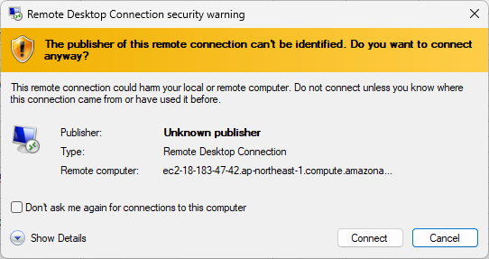
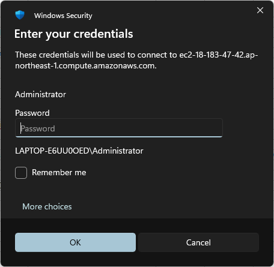
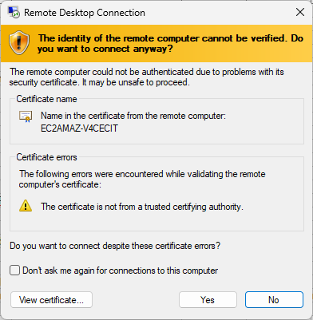
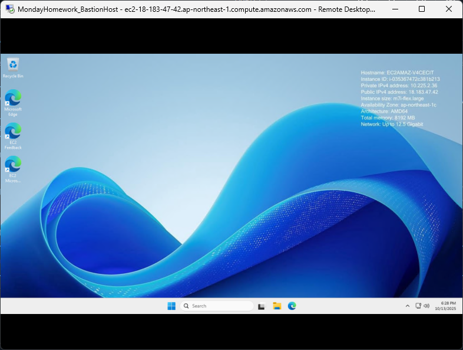
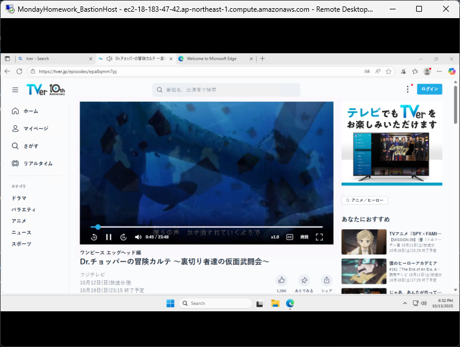
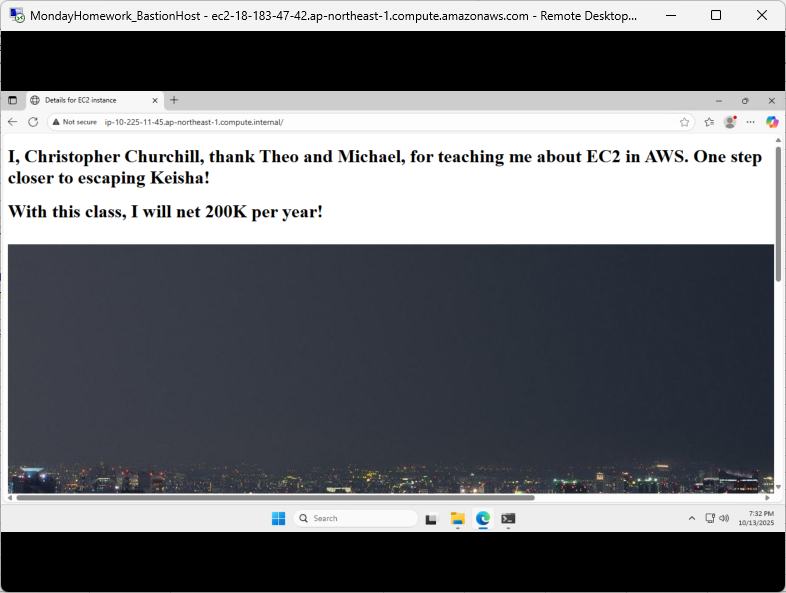
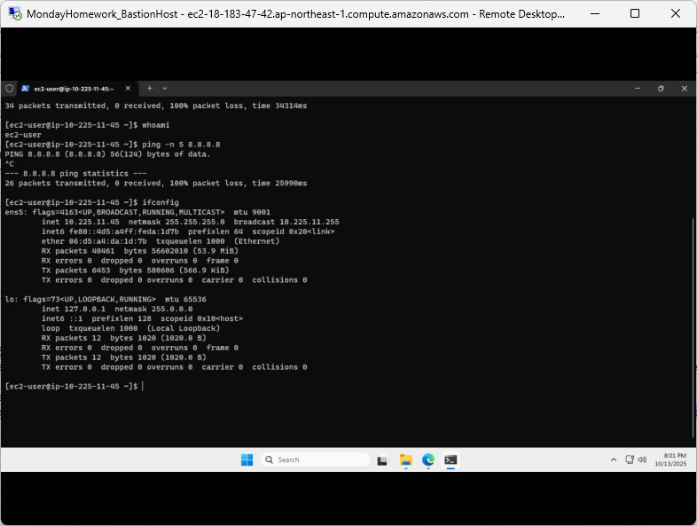
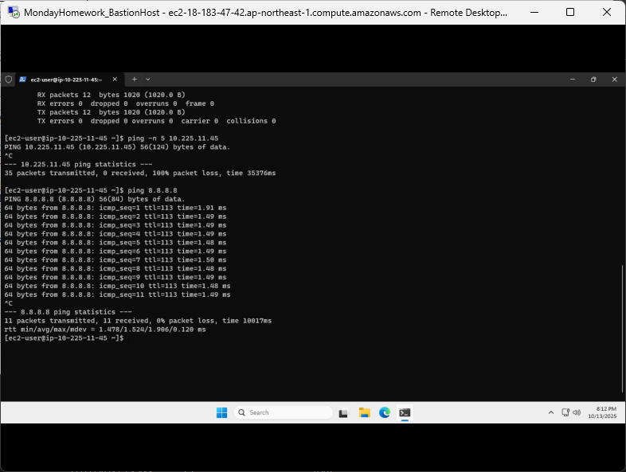

## Week4 Class Notes 						
								
Network Architecture

Asia Pacific (Tokyo)						
						
MondayHomeworkSession-VPC (VPC ID vpc-0ac26c377ad65efac)

VPC Network 10.225.0.0/16

3 – Azs – ap-northeast (1a, 1c, 1d)

						
## Create Security Group

# Public Subnets: Bastion Host
- MondayHomeworkSession-Public
- Inbound Rule: RDP, Anywhere Ipv4, Desc. Webserver
- Tag: Name-MondayHomeworkSession-RDP

- Public 1: 10.225.1.0/24	(Mask: 255:255.255.0)
- Public 2: 10.225.2.0/24	(Mask: 255.255.255.0)
- Public 3: 10.225.3.0/24	(Mask: 255.255.255.0)				
						
# Private Subnets: Via NAT Gateway
- MondayHomeworkSession-Private		
- Inbound Rule: SSH, Anywhere Ipv4, Desc. SSH
- Inbound Rule: HTTP, Anywhere Ipv4, Desc. Ping
- Inbound Rule: All ICMP, Custom: Public SG, Desc. Webserver
- Tag: Name-MondayHomeworkSession-Private

- Private 1a: 10.225.11.0/24 (Mask: 255.255.255.0)
- Private 2a: 10.225.12.0/24 (Mask: 255.255.255.0)
- Private 3a: 10.225.13.0/24 (Mask: 255.255.255.0)			
										
- Private 1b: 10.225.21.0/24 (Mask: 255.255.255.0)
- Private 2b: 10.225.22.0/24 (Mask: 255.255.255.0)
- Private 3b: 10.225.23.0/25 (Mask: 255.255.255.0)				
						
## Class7 assignment goal: In AWS, create a bastion host using an EC2 instance in a public subnet. You SSH into it first, and from there, you connect to private EC2 instances that don’t have public IPs.

For Bastion Host, Advance Detail Script not necessary.  The Bastion Host is an intermediary. Access content within deep inside companies data

Jump server - access private subnets without getting information within private subnets, like read only, located in public subnets.

A bastion host = a secure jump point that protects your internal systems from being exposed to the internet.				
						
## Create EC2 Instance						
- Create Public EC2 “MondayHomework_BastionHost”
- Application&OS Image – Windows Microsoft
- Instance Type: m7i-flex.large 2 vCPU 8 GiB Memory (Windows OS uses more computing power)						
- Keypair: MondayHomeworkSession-RPD.pem						
						
# Network Settings						
- Edit to select created VPCs						
- Select created VPC “MondayHomeworkSession-VPC-vpc”						
- Select created subnet “MondayHomeworkSession-VPC-subnet-public1-ap-northeast-1a” VPC: vpc-0ac26c377ad65efac				
- Auto-assign public IP set to “Enable”						
- Select existing security group “MondayHomeworkSession-Public sg-0f4311bddd5c7f6e5” VPC: vpc-0ac26c377ad65efac				
						
# Launch Instance
- Successfully launched i-035367472c381b213						
						
In the successfully launched instance, use the “Connect” button.						
- Go to “RPD client” tab						
- Download remote desktop file and select “keep” when prompted. This will download the RPD file.						
						
Copy the Public DNS – Need this to provide RPD server name when prompted 						
- Public DNS: ec2-18-183-47-42.ap-northeast-1.compute.amazonaws.com						
- Username info is also required to access RPD						
- Username: Administrator						
						
Password: Select “Get Password”						
- In the following screen, click “Upload private key file”						
- select the recently downloaded keypair.pem file “MondayHomeworkSession-RPD.pem”						
- Notice the Private key contents in the box below has populated						
- Click “Decrypt password”						

Notice return to “RPD Client" screen and passwork is provided.  Copy password. Password will be required to access Remote Desktop Connection (RPD)						
- Password: QBExr.sbWVKNf*@(4y%pYPsv7%F-sG$I						
						
Use the above information and log into RPD. Locate the downloaded RPD file that was downloaded to your PC and run the program.
					
Click the “Connect” button – Credential screen for RDP will appear. 

Note: Username and password is requested.  Provide the information from information in previous section of assignment then click “ok”

Remote Desktop Connection Confirmation screen will appear.  Select “Yes”

Remote Desktop Connection Successful

Use of Tokyo JP AZ successful, confirmation via accessing a website that is only locally accessible.

# Next Step:						
##Create Private EC2 Instance (Linux and script)						
- Name: MondayHomeworkSession-PrivateEC2						
- Amazon Linux Instance Type: t3.micro						
- Select Keypair: MondayHomeworkSession-RPD.pem						
						
# Edit Network Settings						
- VPC “MondayHomeworkSession-VPC-vpc 10.225.0.0/16						
- PRIVATE Subnet: Subnet-0c7e890812f352f6c “MondayHomeworkSession-VPC-subnet-private1-ap-northeast-1a” VPC: vpc-0ac26c377ad65efac						
- Auto-assign public IP set to “Disable”						
- Select existing security group “MondayHomeworkSession-Private sg-00bf8f1c226f6d315” VPC: vpc-0ac26c377ad65efac			
- Provide advance detail script						
						
# Launch Instance						
- Private Ipv4 address: 10.225.11.45						
- Private IP DNS name: ip-10-225-11-45.ap-northeast-1.compute.internal						
						
Run Private EC2 Instance via RDP web browser

in RDP Powershell type: ssh -i "MondayHomeworkSession-RDP.pem" ec2-user@10.225.11.45						
- Also try “MondayHomeworkSession-RPD.pem”, open file on PC, copy the script, open notepad in RPD, and paste script on RPD into Documents folder. Name folder as “key.pem” and select file type as “All”.  Notice txt file is now .pem.				
						
Locate documents folder in Powershell, using cd, ls functions covered in previous class until at “PS C:\users\Administrator\documents”						
- type “ls” to make sure this is the folder where key.pem is in documents folder and then in Powershell type: ssh -i .\key.pem (paste private DNS or IP address “ec2-user@10.225.11.45“ or “ec2-user@ip-10-225-11-45.ap-northeast-1.compute.internal”)						
- Access into Linux command in RDP.  Identified by icon and command line “[ec2-user@ip-10-225-11-45 ~]$”
   				

Ping “Google.com” 8.8.8.8 successful in Linux command in RDP

						

Teardown:						
1. Delete Instance						
2. Delete NAT Gateway						
3. Delete Security Groups						
3. Release Elastic IP A						
4. Delete VPCs						
